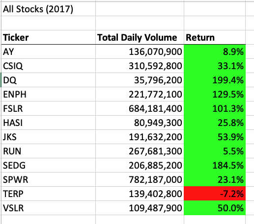
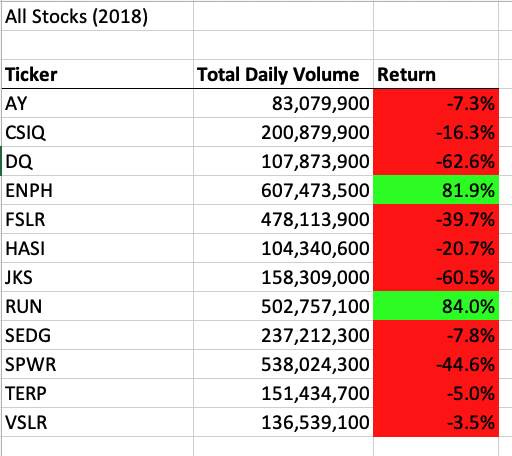

Overview of Project: Explain the purpose of this analysis.

# Project Overview:

- Our project is to apply VBA-Visual Basic for Applications onto Excel spreadsheet data to assist client Steve and his parents analyzing a list of green stocks. We are interested in finding the given green stocks perfomance in each year in 2017 and 2018. Our goal is to create an output analysis to show Steve all 12 stock's total daily trading volume and their respective returns in each year with a simple click of button. From there we are able to show Steve and his parents the best stock investment options.
- As well, we would prefer to refactor the VBA code to optimize speed and effciency. 

## Results:
- The VBA Subroutine we coded was able to quickly reflect an analysis output for 2017 and 2018. It shows the total daily trading volume for each of the 12 tickers and their yearly return performance. Their yearly return was color coded for better illustration, as shown below.

### For year 2017:

- Ticker that is traded the most is SPWR, with total daily tolume of 782,187,000.
- Ticker that has the best positve return is DQ, with a return percentage of 199.4%
- Majority of the green stocks are reuslting a positive return, indicated by the green boxes.
- Only 1 ticker is showing a net negative return, which is TERP (-7.2%)

### For year 2018:

- Ticker that is traded the most is ENPH, with total daily volume 607,473,500.
- Ticker that has the best positve return is RUN, with a return percentage of 84.0% 
- Majority of the green stocks are resulting a negative return, indicated by the red boxes. 

### From analyzing and comparing both years:
- Ticker ENPH and RUN are the only two stocks that had positive returns in both years.
- For the two tickers ENPH and RUN, both reflected an increasing total daily volume in year 2018 compared to 2017. This indicates that both tickers have great future growth potentials.
- Between ENPH and RUN, ENPH had a higher average return and better performance.

    

### Refactoring Code
- For this stock analysis we are also refactoring the VBA codes to improve efficiency. 
- The initial code we created would loop through the entire data repeated number of times to provide the given output. The reason for inefficiency was because our original code was designed to run all the rows to determine if a condition is met. It does not skip any rows even after a condition is met for that specific ticker stock and would continue searching the data. 
- Our goal is to create a code which loops through the data for only one time to collect the same information. The key to our improvement involves refactoring the code to loop through the data by ticker names, or their referred ticker indexes, instead of all the rows. The refactored code was able to avoid redundant searches, save the outputs when a certian condition is met, and skip to next directed statements without going back and loop from the very beginning.  The full refactored VBA subroutine code is as shown below: 

            
Sub AllStocksAnalysisRefactored()

    Dim startTime As Single
    Dim endTime  As Single

    yearValue = InputBox("What year would you like to run the analysis on?")

    startTime = Timer
    
    'Format the output sheet on All Stocks Analysis worksheet
    Worksheets("All Stocks Analysis").Activate
    
    Range("A1").Value = "All Stocks (" + yearValue + ")"
    
    'Create a header row
    Cells(3, 1).Value = "Ticker"
    Cells(3, 2).Value = "Total Daily Volume"
    Cells(3, 3).Value = "Return"

    'Initialize array of all tickers
    Dim tickers(12) As String
    
    tickers(0) = "AY"
    tickers(1) = "CSIQ"
    tickers(2) = "DQ"
    tickers(3) = "ENPH"
    tickers(4) = "FSLR"
    tickers(5) = "HASI"
    tickers(6) = "JKS"
    tickers(7) = "RUN"
    tickers(8) = "SEDG"
    tickers(9) = "SPWR"
    tickers(10) = "TERP"
    tickers(11) = "VSLR"
    
    'Activate data worksheet
    
    Worksheets(yearValue).Activate
    
    'Get the number of rows to loop over
    RowCount = Cells(Rows.Count, "A").End(xlUp).Row
    
    '1a) Create a ticker Index
    tickerIndex = 0

    '1b) Create three output arrays
    Dim tickerVolumes(12) As Long
    Dim tickerStartingPrices(12) As Single
    Dim tickerEndingPrices(12) As Single
    
    ''2a) Create a for loop to initialize the tickerVolumes to zero.

    For i = 0 To 11
    
        tickerVolumes(i) = 0
        
    Next i
    
    ''2b) Loop over all the rows in the spreadsheet.
    For i = 2 To RowCount
    
        '3a) Increase volume for current ticker
         tickerVolumes(tickerIndex) = tickerVolumes(tickerIndex) + Cells(i, 8).Value
        
         '3b) Check if the current row is the first row with the selected tickerIndex.
            'If  Then
        If Cells(i - 1, 1).Value <> tickers(tickerIndex) And Cells(i, 1).Value = tickers(tickerIndex) Then
            tickerStartingPrices(tickerIndex) = Cells(i, 6).Value

        End If
        
        '3c) check if the current row is the last row with the selected ticker
         'If the next row’s ticker doesn’t match, increase the tickerIndex.
        'If  Then
            
        If Cells(i + 1, 1).Value <> tickers(tickerIndex) And Cells(i, 1).Value = tickers(tickerIndex) Then
            tickerEndingPrices(tickerIndex) = Cells(i, 6).Value

        '3d Increase the tickerIndex.
            tickerIndex = tickerIndex + 1
 
        End If
    
    Next i
    
    '4) Loop through your arrays to output the Ticker, Total Daily Volume, and Return.
    For i = 0 To 11
        
    Worksheets("All Stocks Analysis").Activate
    Cells(4 + i, 1).Value = tickers(i)
    Cells(4 + i, 2).Value = tickerVolumes(i)
    Cells(4 + i, 3).Value = tickerEndingPrices(i) / tickerStartingPrices(i) - 1
    
    Next i
    
    'Formatting
    Worksheets("All Stocks Analysis").Activate
    Range("A3:C3").Font.FontStyle = "Bold"
    Range("A3:C3").Borders(xlEdgeBottom).LineStyle = xlContinuous
    Range("B4:B15").NumberFormat = "#,##0"
    Range("C4:C15").NumberFormat = "0.0%"
    Columns("B").AutoFit

    dataRowStart = 4
    dataRowEnd = 15

    For i = dataRowStart To dataRowEnd
        
        If Cells(i, 3) > 0 Then
            
            Cells(i, 3).Interior.Color = vbGreen
            
        Else
        
            Cells(i, 3).Interior.Color = vbRed
            
        End If
        
    Next i
 
    endTime = Timer
    MsgBox "This code ran in " & (endTime - startTime) & " seconds for the year " & (yearValue)

    End Sub

- As a result, our run time for 2017 and 2018 were both about 5-6 times faster than the original All-stock-analysis. The runtimes for the refactored analysis macro for each year were posted below.

## Summary

### Advantages of Refactoring
- Refactoring is to optimize existing code while maintain the same outcome. It could help improve readability, clarity and efficiency of code. By tiny steps the code could have a better performance and may save time and even money. As for our project, it increases the speed of our macro output by 5 times faster. Imagine if we are to work on a database in the future for Steve that is essentially 1000 times larger, we would be saving substantial amount of time to see the results.

### Disadvantages of Refactoring
- Refactoring could be very time-comsuming, as it takes time to re-structure the code. If certain steps are done incorrectly it takes even more time to debug and fix the error. As well, if refactoring is done improperly it may change and disrupt the resulting output.

### How do these pros and cons apply to refactoring the original VBA script?
- We definelty have enjoyed some benefits from refactoring the original code for Steve. As mentioned previously, it increased the speed and efficiency for our output result by nearly 5 times. More importantly, the refactored code is now very clear, concise and easy to understand, and is re-usable. In case Steve needed to analyze more data in the future, we could easily apply the current refactored code structure with mininal additions to obtain an output.

- As for disadvantages, refactoring the original VBA script for this project was not as necessary considering the time effort spent versus the end results difference. The refactoring needed hours of work (and debug), while the end result was only improved by ~0.5 seconds.  Fortunately we received help and hints from the project module itself. However, in reality if we are to refactoring code from scratch, it would be much more difficult to complete. 

